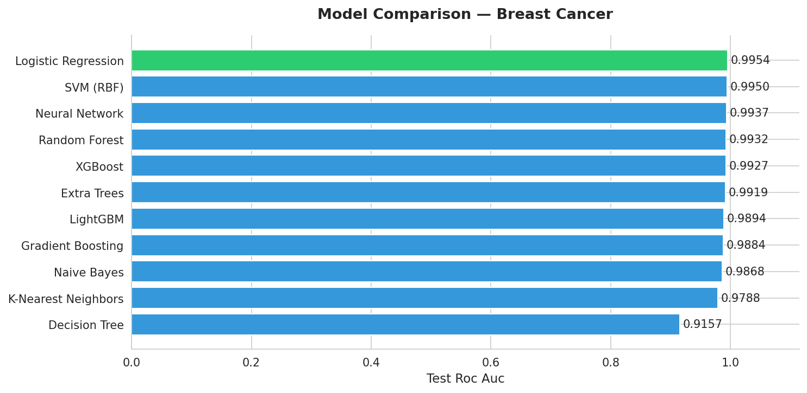
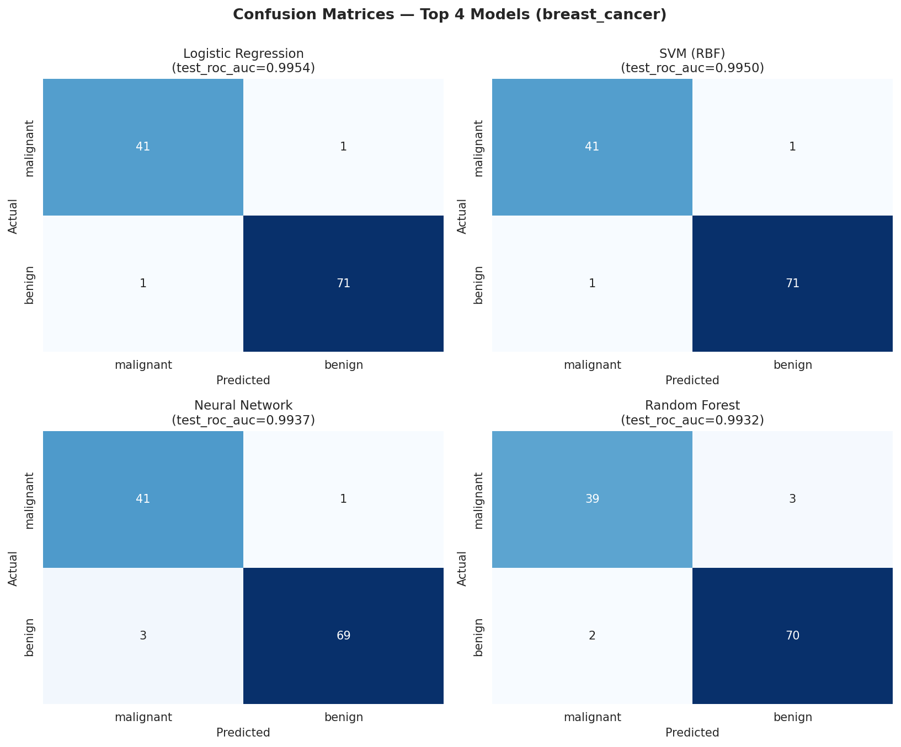
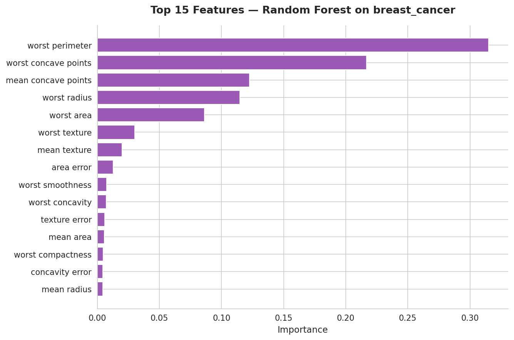

# Model Arena

[](https://github.com/KireetiMAX1/model-arena/actions)
[](tests/)
[](https://www.python.org/)
[](LICENSE)

A self-contained ML benchmarking framework that runs entirely inside **GitHub Actions**. Every push trains 11 models, runs 5-fold cross-validation, generates plots, and auto-commits the updated leaderboard back into this README — no local setup, no cloud, no API keys required.

---

<!-- LEADERBOARD_START -->
## 🏆 Leaderboard — Breast Cancer

**Task**: classification | **Train**: 455 | **Test**: 114 | **Features**: 30
**Updated**: 2026-06-22 08:21:41 UTC (commit `3fcaa65`)

| Rank | Model | Accuracy | F1 | ROC-AUC | CV ROC-AUC | Time (s) |
|---|---|---|---|---|---|---|
| 🥇 | **Logistic Regression** | 0.9825 | 0.9861 | 0.9954 | 0.9957 | 1.9500 |
| 🥈 | SVM (RBF) | 0.9825 | 0.9861 | 0.9950 | 0.9957 | 0.0700 |
| 🥉 | Neural Network | 0.9649 | 0.9718 | 0.9937 | 0.9950 | 0.9000 |
| 4 | Random Forest | 0.9561 | 0.9655 | 0.9932 | 0.9894 | 1.2800 |
| 5 | XGBoost | 0.9474 | 0.9589 | 0.9927 | 0.9924 | 0.6500 |
| 6 | Extra Trees | 0.9561 | 0.9655 | 0.9919 | 0.9942 | 1.0000 |
| 7 | LightGBM | 0.9561 | 0.9655 | 0.9894 | 0.9922 | 0.8300 |
| 8 | Gradient Boosting | 0.9474 | 0.9583 | 0.9884 | 0.9631 | 2.9000 |
| 9 | Naive Bayes | 0.9298 | 0.9444 | 0.9868 | 0.9884 | 0.0300 |
| 10 | K-Nearest Neighbors | 0.9561 | 0.9655 | 0.9788 | 0.9879 | 0.0700 |
| 11 | Decision Tree | 0.9123 | 0.9286 | 0.9157 | 0.9179 | 0.1100 |

_Primary metric: **test_roc_auc** · Best model wins 🥇_





<!-- LEADERBOARD_END -->

---

## How It Works

```
git push
    │
    ▼
GitHub Actions
    │
    ├── pytest (15 unit tests must pass)
    │
    ▼
Benchmark pipeline
    ├── Load dataset (sklearn bundled — no network)
    ├── Train 11 models with stratified 5-fold CV
    ├── Evaluate on held-out test set
    └── Generate plots + leaderboard table
    │
    ▼
Auto-commit back to main
    ├── README.md  (leaderboard table)
    ├── assets/    (comparison, confusion matrix, feature importance plots)
    └── results/   (raw CSV + JSON scores)
```

Results are reproducible: `SEED=42` and bundled sklearn datasets mean every run produces bit-identical output.

---

## Models Benchmarked

| Category | Models |
|----------|--------|
| Linear | Logistic Regression, Ridge Regression, ElasticNet |
| Tree-based | Decision Tree, Random Forest, Extra Trees, Gradient Boosting |
| Boosting | XGBoost, LightGBM |
| Other | SVM (RBF), Neural Network (MLP), K-Nearest Neighbors, Naive Bayes |

All classification models are evaluated on **ROC-AUC** (stratified 5-fold CV + held-out test). Regression models use **R²**. CV mean ± std is reported for every model.

---

## Datasets Included

All five are bundled with scikit-learn — zero network calls required in CI:

| Dataset | Task | Samples | Features | Classes |
|---------|------|---------|----------|---------|
| Breast Cancer | Classification | 569 | 30 | 2 |
| Wine | Classification | 178 | 13 | 3 |
| Iris | Classification | 150 | 4 | 3 |
| Digits | Classification | 1,797 | 64 | 10 |
| Diabetes | Regression | 442 | 10 | — |

---

## Quickstart

### Run via GitHub Actions
1. Fork this repo
2. **Actions → Benchmark Suite → Run workflow**
3. Select a dataset → watch the run → check the updated leaderboard in `main`

### Run locally
```bash
git clone https://github.com/KireetiMAX1/model-arena
cd model-arena
pip install -r requirements.txt

# Single dataset
python src/run_benchmark.py --dataset breast_cancer

# All datasets
python src/run_benchmark.py --all

# Fast mode (skips slower models)
python src/run_benchmark.py --quick
```

---

## Project Structure

```
model-arena/
├── src/
│   ├── run_benchmark.py    # main orchestrator
│   ├── data_loader.py      # sklearn dataset loading + standardization
│   ├── models.py           # model registry (add models here)
│   ├── evaluation.py       # metrics and cross-validation utilities
│   └── reporting.py        # plots, leaderboard generation, README updater
├── tests/
│   └── test_benchmark.py   # 15 unit + integration tests
├── results/                # generated CSVs and JSON score files
├── assets/                 # generated plots
├── .github/
│   └── workflows/
│       └── benchmark.yml   # CI: test → benchmark → auto-commit
└── requirements.txt
```

---

## Test Suite

15 tests covering the full pipeline, all pass on every CI run:

```
tests/test_benchmark.py::test_load_dataset[breast_cancer]   PASSED
tests/test_benchmark.py::test_load_dataset[wine]            PASSED
tests/test_benchmark.py::test_load_dataset[iris]            PASSED
tests/test_benchmark.py::test_load_dataset[diabetes]        PASSED
tests/test_benchmark.py::test_load_dataset[digits]          PASSED
tests/test_benchmark.py::test_load_unknown_dataset_raises   PASSED
tests/test_benchmark.py::test_data_is_standardized          PASSED
tests/test_benchmark.py::test_classification_models_load    PASSED
tests/test_benchmark.py::test_regression_models_load        PASSED
tests/test_benchmark.py::test_quick_mode_skips_slow_models  PASSED
tests/test_benchmark.py::test_get_all_models_routes_by_task PASSED
tests/test_benchmark.py::test_evaluate_classification       PASSED
tests/test_benchmark.py::test_evaluate_regression           PASSED
tests/test_benchmark.py::test_cross_validate_returns_mean_and_std PASSED
tests/test_benchmark.py::test_smoke_run_single_model        PASSED
```

---

## Extending the Suite

### Add a model
Edit `src/models.py` — it's picked up automatically:
```python
"My Model": lambda: MyClassifier(param=value, random_state=SEED),
```

### Add a dataset
Edit `src/data_loader.py`:
```python
DATASETS["my_dataset"] = {"task": "classification", "loader": my_loader_fn}
```

The leaderboard, plots, and README all regenerate on the next CI run.

---

## Skills Demonstrated

| Area | Implementation |
|------|---------------|
| Model selection & tuning | 11 models with deliberate hyperparameter choices in `src/models.py` |
| Statistical rigor | Stratified 5-fold CV with mean ± std reported per model |
| Reproducibility | Fixed seed + bundled datasets — bit-identical results across runs |
| CI/CD | GitHub Actions pipeline: test gate → benchmark → auto-commit |
| Software design | Single-responsibility modules, type hints throughout |
| Testing | 15 tests: unit, parametrized, integration smoke test |
| Data visualization | Seaborn/Matplotlib: bar chart, confusion matrix grid, feature importance |

---

## License

MIT © [Kireeti Addagada](https://github.com/KireetiMAX1)
